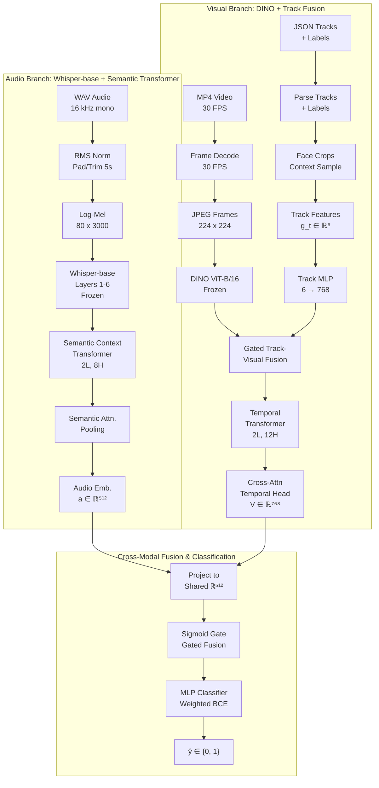

# Who is Talking to Me? 
**Gated Audio-Visual Fusion with Whisper Acoustic Representations and DINO Vision Transformers**

## Problem Statement
 
Given an egocentric video clip (audio + video frames + person-track bounding boxes), predict for each tracked person at each annotated frame a binary label **y ∈ {0, 1}** — does this person direct speech toward the camera wearer or not ?
 
```
Input:
  ├── MP4 video     (30 FPS, 1920×1080)
  ├── WAV audio     (16 kHz mono)
  └── JSON tracks   (per-frame bounding boxes)
 
Output:
  └── Binary label + probability score per (person, frame) pair
```
---

## System Architecture & Pipeline




---

## Installation
 
### Prerequisites
 
- Python 3.10
- CUDA 12.4
- NVIDIA GPU with ≥ 16 GB VRAM (tested on RTX A5000 24 GB)
### Environment Setup
 
```bash
# Create conda environment
conda create -n env_name python=3.10
conda activate env_name
 
# Install PyTorch (CUDA 12.4)
pip install torch==2.4.1 torchaudio==2.4.1 \
    --index-url https://download.pytorch.org/whl/cu124
 
# Install HuggingFace stack
pip install transformers==5.5.0
pip install tokenizers==0.22.0
pip install accelerate==0.34.2
pip install huggingface_hub==1.9.0 --force-reinstall --no-deps
 
# Install audio/vision libraries
pip install soundfile==0.12.1
pip install librosa==0.10.2 --no-deps
pip install soxr einops tqdm
 
# Install ML utilities
pip install scikit-learn pyyaml
```
 
## Dataset Setup
 
### Ego4D Annotations
 
```bash
# Download Ego4D AV annotations
# Place in:
/DATA/G17/ego4d_data/v2/annotations/
  ├── av_train.json
  └── av_val.json
```
### Pre-processed Data
 
The pipeline uses frame-level extracted annotations:
 
```
/DATA/G17/Data/extract_data/
  ├── ttm_train_data.json       # frame-level train annotations
  └── ttm_validation_data.json  # frame-level val annotations
```
 
**Format of each entry:**

```json
{
  "video_uid":  "85775377-b334-4bd7-8cfc-16885099cc9a",
  "clip_uid":   "c2413391-7c1b-4fd6-8b1d-98ee7888b9f8",
  "person_id":  "1",
  "frame":      1055,
  "bbox":       [1569.54, 740.81, 66.7, 80.89],
  "ttm_label":  0
}
```

## Training
 
### Full Pipeline 
 
```bash
# Step 1: Train audio model
cd Audio/
python run.py
# Checkpoint saved to: experiments/whisper_audio_baseline/best_model.pth
 
# Step 2: Train visual model
cd Visual/
python run.py
# Checkpoint saved to: experiments/visual_baseline/best_model.pth
 
# Step 3: Extract audio embeddings
cd Audio/
python extract_embeddings.py
# Output: /DATA/G17/Data/extracted_features/audio/train/
 
# Step 4: Extract visual embeddings
cd Visual/
python extract_features.py
 
# Step 5: Train fusion model
cd Fusion/
python train_fusion.py
```
## Results
 
| Model | Accuracy | F1 | mAP ★ | AUC-ROC |
|---|---|---|---|---|
| Audio Only (Whisper + SCT) | 0.648 | 0.63 | 0.611 |**0.720**|
| Visual Only (DINO + Tracks) | 0.627 | 0.53 | 0.595 | 0.636 |
| **Full Model (Gated Fusion)** ✓ | 0.575 | 0.61 | **0.635** | 0.668 |

## References
 
1. Hsi-Che Lin et al., *QUAVF: Quality-Aware Audio-Visual Fusion for Ego4D Talking to Me Challenge*, ArXiv 2023.
2. R. Tao et al., *Is Someone Speaking to Me? Detecting Directed Speech in Egocentric Video*, CVPR 2021.
3. K. Grauman et al., *Ego4D: Around the World in 3,000 Hours of Egocentric Video*, CVPR 2022.
4. A. Radford et al., *Robust Speech Recognition via Large-Scale Weak Supervision*, ICML 2023.
5. M. Caron et al., *Emerging Properties in Self-Supervised Vision Transformers*, ICCV 2021.
6. A. Baevski et al., *wav2vec 2.0: A Framework for Self-Supervised Learning of Speech Representations*, NeurIPS 2020.
---

 
